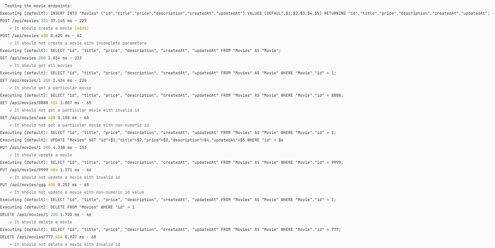
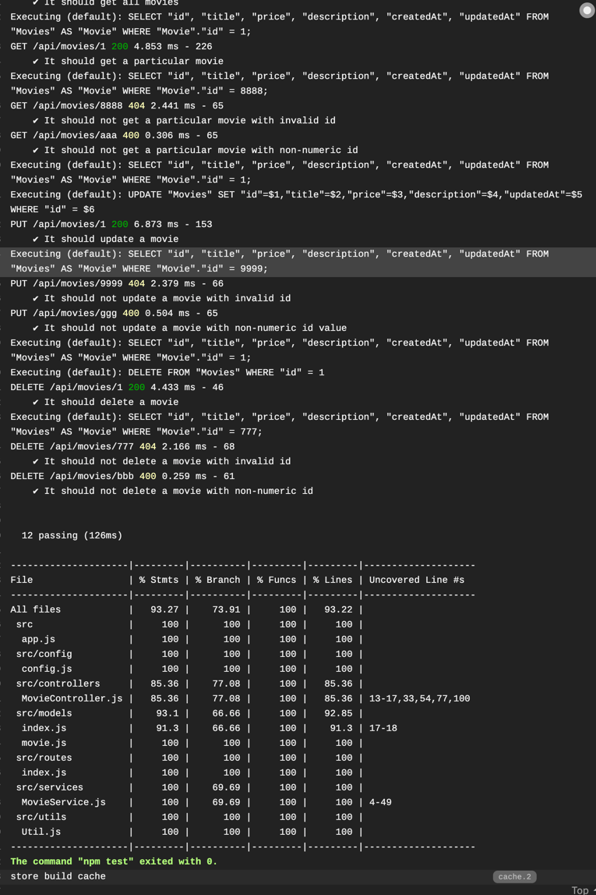

# CS3219 Task B1, B2, B3

## API endpoint

The endpoint can be accessed at [https://cs3219-taskb-postgres.herokuapp.com/](https://cs3219-taskb-postgres.herokuapp.com/)   
Deployment is automated through the use of heroku and travis. Each push into the master branch triggers travis, which runs both CI and CD.

## Setting up locally

1. Create a `.env` file at the root of the directory and copy the content of `.env.example` to `.env` Change the user and password of the database accordingly.
2. Run `npm i` to install the dependencies.
3. Start postgres server
   1. For MacOS: Run `brew services start postgresql` to make sure PostgreSQL is running
4. Run `createdb movies` to create the database for development.
5. Run `createdb movie_test` to create the database for testing.
6. Run `npm run startdev` to start the server.
7. The deployed API can be accessed at [http://localhost:3000/api/movies](http://localhost:3000/api/movies)

## Testing

### Using Postman

1. Use the postman collection to run the tests in order [https://www.getpostman.com/collections/7c4af0a85f99e650494a)](https://www.getpostman.com/collections/7c4af0a85f99e650494a)
2. Feel free to add your own tests

### Local Test

1. Run `npm run test`
2. You should see the CRUD endpoints being tested, with 12 tests in total passing.

### Travis

Tests for travis are triggered by:

1. Installing dependencies and building project
2. Setting environment variables
3. Running tests

## Resources:

- https://expressjs.com/en/starter/hello-world.html
- https://medium.com/@dinyangetoh/how-to-build-simple-restful-api-with-nodejs-expressjs-and-mongodb-99348012925d
- https://www.smashingmagazine.com/2020/04/express-api-backend-project-postgresql/
- https://medium.com/@victorsteven/restful-api-with-nodejs-express-postgresql-sequelize-travis-mocha-coveralls-and-code-climate-f28715f7a014
